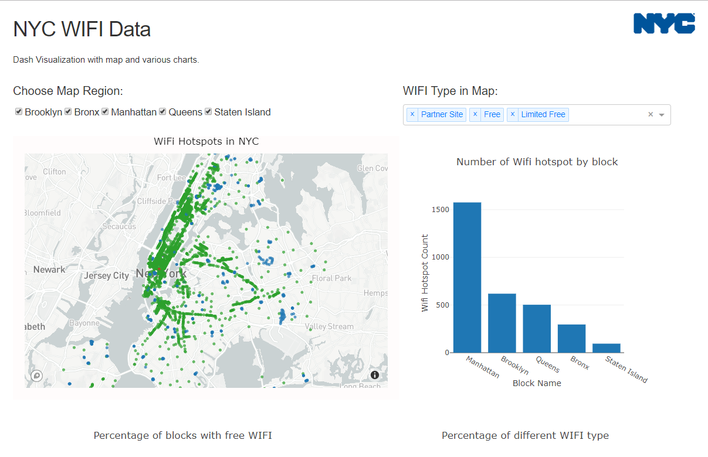

# NYC-WIFI-Hotspot-Visualization
A Visualization project to visualize NYC WIFI Hotspot Data

## Deployde on Heroku:
Click the link here: [Link to Dashboard](https://nyc-wifi-dashapp.herokuapp.com/)

### Tools used:
Dash, Plotly, and Mapbox

## Screenshots:
### 1. Scatter Map and Bar chart

### 2. Two Donut Charts

### 3. Horizontal Percentage Stacked Bar Chart

